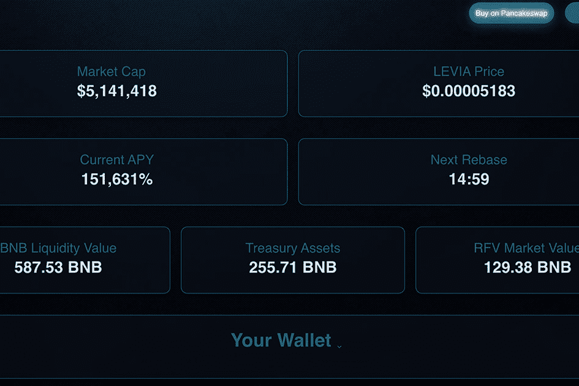

# Leviathan

Leviathan 是一个受 TITANO 启发的质押协议。由来自 TempliersCrypto 的 doxxed 团队构建，并由 Solidity Finance 审计。每 30 分钟通过奖励赚取固定的 151,631% APY。

最近没有太多消息，因为大海（和市场）很平静，但这是对剩余水手的新投票！

尽管整个加密货币生态系统出现熊市，我们仍想对仍然存在的持有者给予特别的认可！

以下是新 RFV 分发的详细选项：

选项1
剩余的 RFV 将分配给 5 名持有者，完成任务后随机抽取。
符合条件的限制固定为至少在上个月持有 500 万美元 LEVIA（在此公告之后不要购买）。

选项 2
剩余的RFV将分配给3名持有者，完成任务后随机抽取。
符合条件的限制固定为至少在上个月持有 500 万美元 LEVIA（在此公告之后不要购买）。

选项 3
剩余的 RFV 将分配给 ONE 持有者，在完成任务后随机抽取。
符合条件的限制固定为至少在上个月持有 500 万美元 LEVIA（在此公告之后不要购买）。

