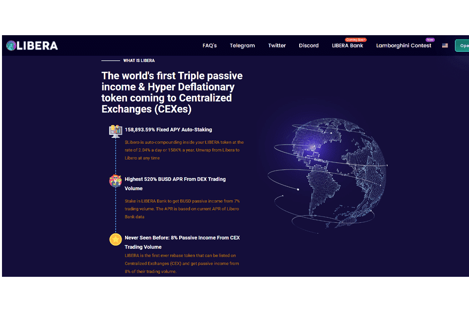

# Libera.financial

世界上第一个三重被动收入和超通缩令牌进入中心化交易所（CEXes）
Libero Financial 在 Defi 领域的下一个突破——一项创新，使 158,893.59% 的固定 APY 代币成为超通缩
一项改变整个行业游戏规则的创新：将 Libero 包装到 Libera 中，从而可以在 CEXes 上上市并在矿池中进行质押，而 Libera 代币在 Libera 内部仍然每天增长 2.04% 或每年增长 158,900.00%。
创造 Defi 的历史，Libero Financial Freedom 将推出世界上第一个正向 rebase 令牌进入集中式交易所（CEXes）。
与其他具有通胀性且供应无限的 rebase 代币不同，LIBERA 的供应量有限，为 5000 万个，其中 18% 将在发布时销毁，根据 Libero 每周 1-4% 的销毁速度每周将销毁更多。更重要的是，每卖出 25% 的代币就会被烧毁——整个市场中最高的烧毁百分比——使 LIBERA 成为前所未有的超级通缩代币。

