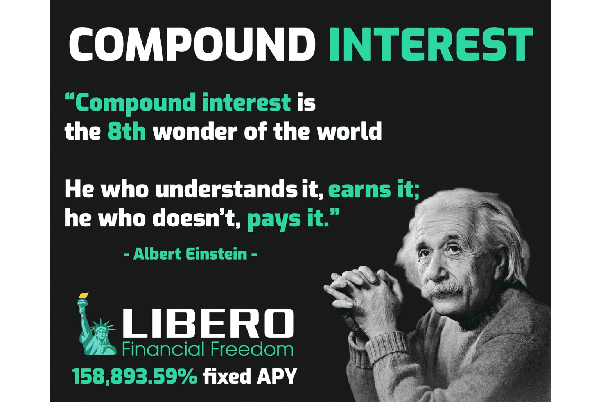

# Libero Financial

Libero Finance 正在改变 DeFi，其双重奖励 158,893.59% 固定 APY 加上 226% BUSD APR 被动收入来自交易量，每 30 分钟复合奖励，在一个简单的买入持有赚取系统中，无需做任何事情，就可以为自己带来稳定的被动收入。

LIBERO 是财务自由的先驱，他们正在建立被动收入的黄金标准，以改变整个 Defi 空间。
‎Libero.Financial · ‎Libero 银行 · ‎账户

Libero 奖励持有者固定 APY - 158,893.59%，无需做任何事情，并使用自动回购和销毁来支持价格

