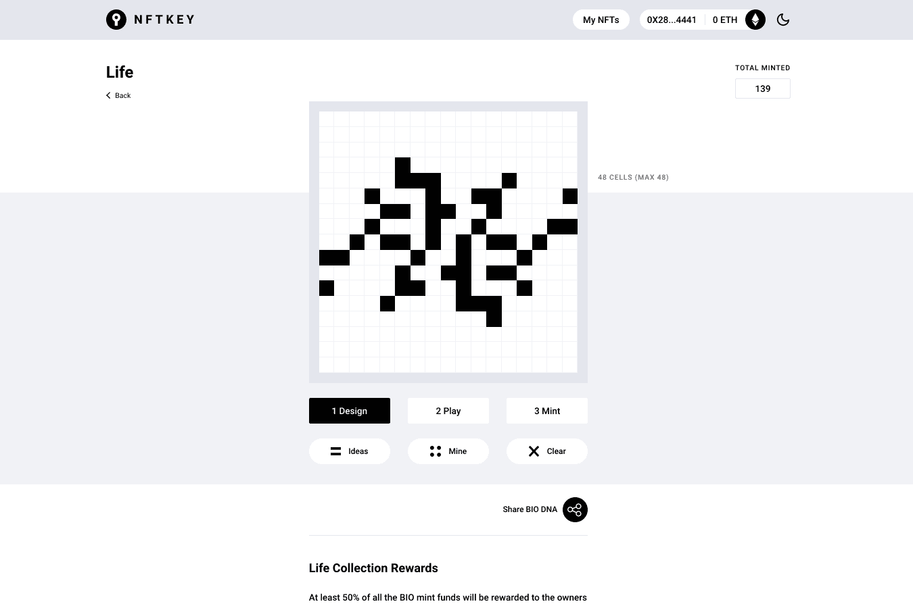

# Life Collection

在细胞网格中创建元胞自动机并观察它的生命。每个 BIO 也将成为一个超级有机体的一部分，一旦所有生物都被铸造出来，它们就会相互作用。成为生命游戏模拟的一部分，创造有机生物。
分类为良好的 BIO 将有资格获得所有 Life Collection 联合曲线基金的至少 50%。第一个真正活生生的 NFT 收藏品之一。 BIO 可以与其他 NFT 交互、合并和进化。以长寿的世代循环和生命周期为目标。
生活收藏奖励
至少 50% 的 BIO 铸币基金将奖励给所有者
1. 玩游戏
  奖励基于 BIO 的第一帧、生命或循环的长度以及 BIO 在铸造时的价格

2. 规则 1
  故意创建具有可识别的第一帧的 BIO 可能会获得较少的奖励。

3. 规则 2
  具有敏感和不适当的第一帧设计的 BIO 将不会获得任何奖励。

4. 游戏目标
  Life Collection 的目标是创建有趣的循环和长寿的 BIO 时间线。
  任何拥有分配数量的 ETH 或 BNB 和非托管钱包的人都可以通过在 17*17 网格上定义初始活动状态来创建和铸造 BIO NFT。可以激活最少 5 个，最多 48 个单元。使用“我的”按钮立即设计有资格获得全额奖励的优秀 BIO 表格。

  
