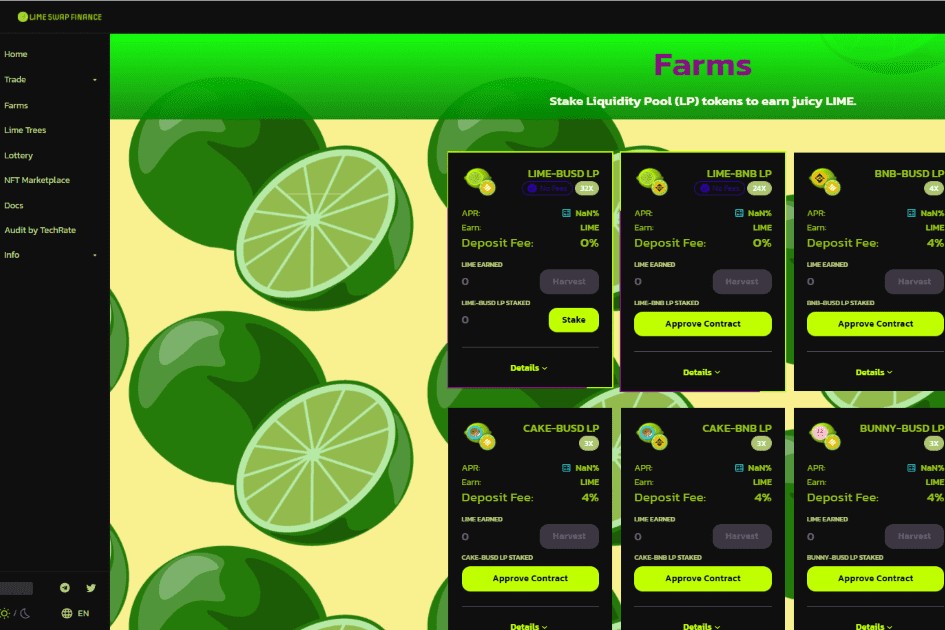

# LimeSwap

LimeSwap 是在币安智能链和 Pancake 交易所上运行的去中心化交易所，具有让您赚取和赢取代币的额外功能。
我们是一个由充满激情的软件开发人员、数字营销人员、管理顾问以及加密和传统投资者组成的去中心化团队，他们对自动化做市商平台 (AMM) 以及 DeFi 未来应用程序实现的潜力感到兴奋。
我们的最终目标是通过使用 $LIME 进行交易并在主要交易所上市来创建一个 NFT 市场。
LimeSwap 是币安智能链上可靠的下一代收益农场，具有独特的功能

  独特的燃烧机制
  彩票
  团队专注于构建和交付价值。
  安全性：时间锁定、迁移代码移除、审核
  对hodlers和早期投资者的适当激励

