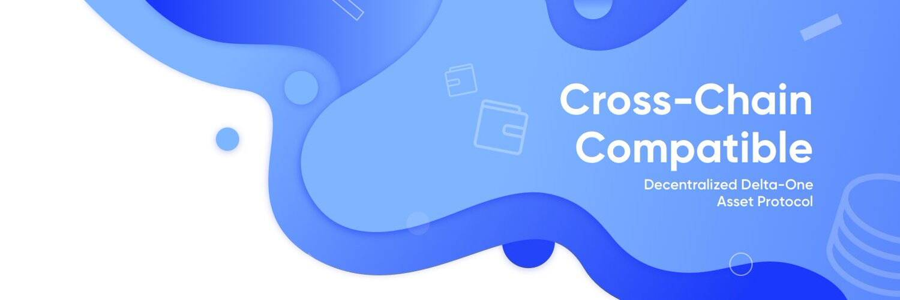

# Linear Finance

线性金融（“线性”）是一种非托管、跨链兼容的 delta-one 资产协议。 Linear 的长期 DeFi 愿景是增加包容性并使投资资产（数字和传统）的获取民主化。投资者能够轻松快速地投资、节省费用并以公平的市场价值保护资产，这具有巨大的价值。 Linear 将众多加密项目的丰富技术经验与传统全球资产管理公司在异国和结构化资产方面的丰富金融经验相结合，将基于以太坊的第一个具有跨链兼容性的 DeFi 项目推向市场。 Linear 将允许用户通过一系列创新的数字和传统金融产品建立和管理现货或投资组合风险敞口。 Linear 由我们基于 ETH 的线性代币 (LINA) 提供支持，合成资产首先建立在其他 EVM 兼容链和其他主要区块链上，从长远来看，使质押、投资和赎回过程更容易、更快，并且交易费用大大降低同时保持对以太坊 DeFi 生态系统的访问。

