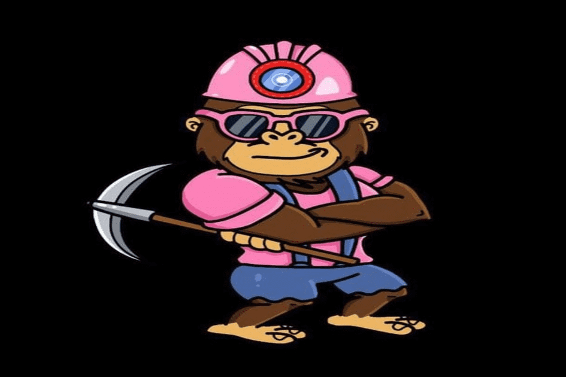

# LINK MINER FINANCE

什么是 LINK 矿工？当我的桶装满时会发生什么？我可以取回最初的存款吗？矿工工作多长时间？费用是多少？推荐如何运作？ LINK Miner 的可持续性如何？
LINK Miner 是一个基于币安智能链的去中心化应用程序，平均每天向您支付 6% 的 LINK 存款到 LINK Miner 合约中。每日投资回报率百分比取决于几个因素。
您的矿工不会停止为您工作，但是如果您在 24 小时内复合（雇用更多矿工）或认领（口袋）您的 LINK div，这将是有益的。这是保持人们参与的一种方式。
一旦您存款，您将无法收回。随着时间的推移，您只能通过将 LINK div 装袋而慢慢地赚回它。
只要合约充满资金，矿工就会无限期地为你工作。它们不能出售或交换。
在每笔存款中，2.5% 进入团队钱包以进行进一步开发，2.5% 进入营销钱包以发展平台和 Miner Apes 品牌。
将钱包连接到网站后，您将在页面底部看到您的推荐链接。在您的链接下存款的人是您推荐的，您可以获得他们存款价值的 10%。所以带上你的朋友和伙伴！
与其他类似的 dapp 相比，LINKMiner 的每日回报较低，旨在持续很长时间。

