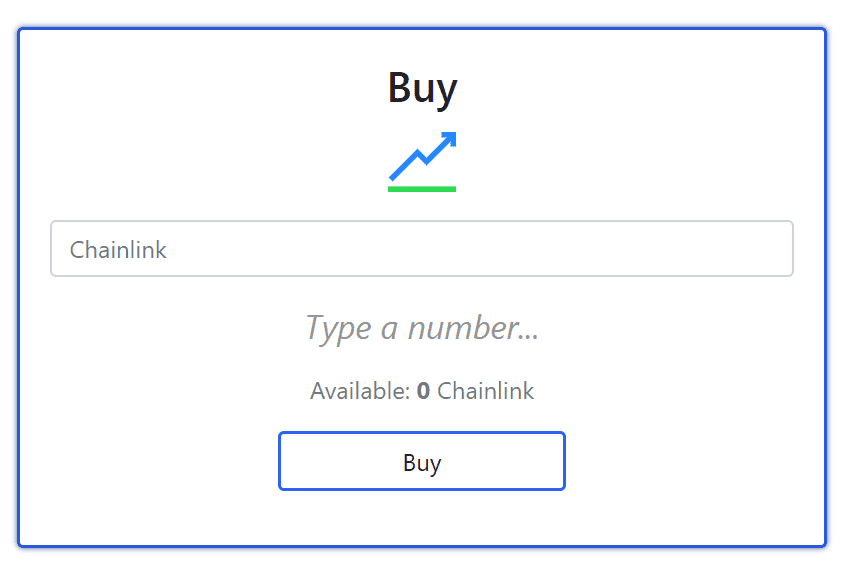

# Link3D

Link3D 是我们自己的 Link3D 代币的去中心化交易所。每次买入都会提高代币的价格，而每次卖出都会相反。 Link3D持有者根据其持有量获得交易所的交易费用。不仅如此，您还将从我们即将推出的游戏和项目中获得红利。

从单一平台管理、组织和协调所有后处理操作，以满足项目要求。减少生产错误。最小化 ...链接3D |领英上有 3224 位关注者。 Link3D 提供基于 SaaS 的解决方案，以帮助组织扩展和优化其增材制造生态系统。

