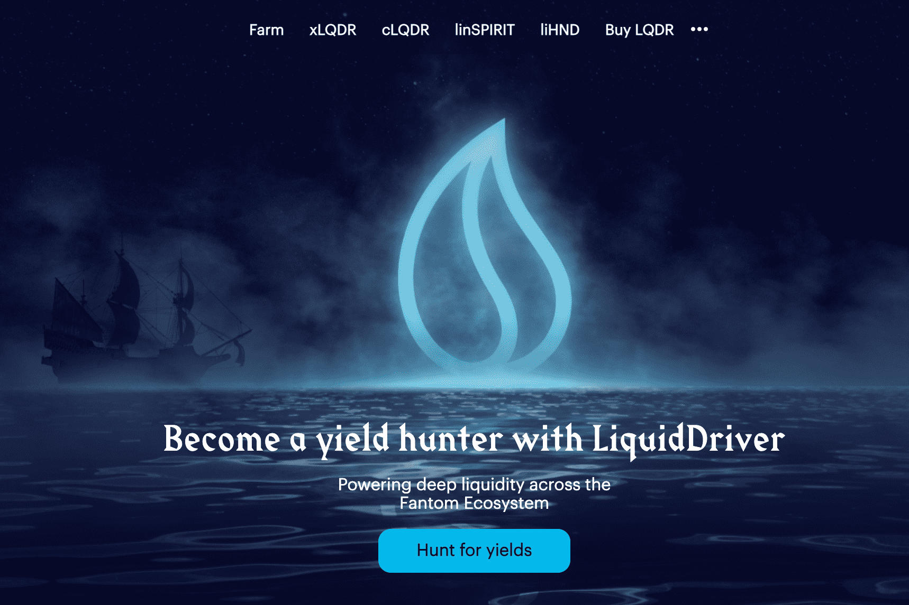

# Liquid Driver

Fantom 上 Sushiswap 的第一个高收益流动性挖矿 dapp
LiquidDriver 旨在防止以下情况：

  鲸鱼用大量资金操纵游戏，并向其他赌注者倾销。
  密集的代币发行最终导致价格压制。
  非 LQDR 货币对的流动性提供者承担的风险较小，并且倾向于“耕种和抛售”。

LiquidDriver 将利用四种解决方案来解决这些问题，并根据他们面临的风险按比例奖励流动性提供者：存款费用、回购、游戏化和 LQDR 的价值捕获机制。
