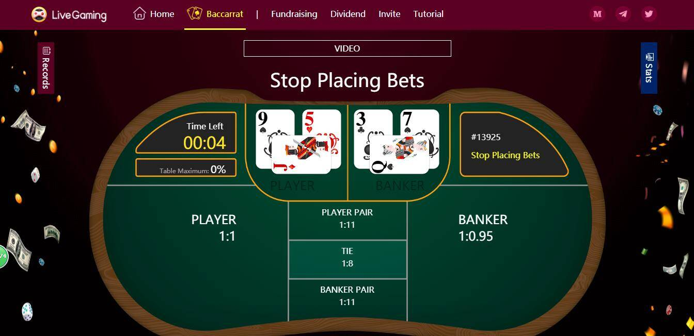

# LiveGaming

LiveGaming是第一个基于跨链技术的娱乐直播平台，主播通过视频直播与玩家互动。 玩家可以享受基于丰富多样的游戏形式的高度身临其境的娱乐体验。 LiveGaming 包括赌博游戏、休闲游戏和棋盘游戏。 为了促进DAPP的生态发展，我们的平台致力于将更多的游戏形式与区块链技术相结合。 LiveGaming 采用新的跨链技术，支持三种公链：以太坊、EOS 和 TRON。 发行的LGT代币可以在三大公链上自由流通，实现跨链挖矿、跨链兑换、跨链分红。

