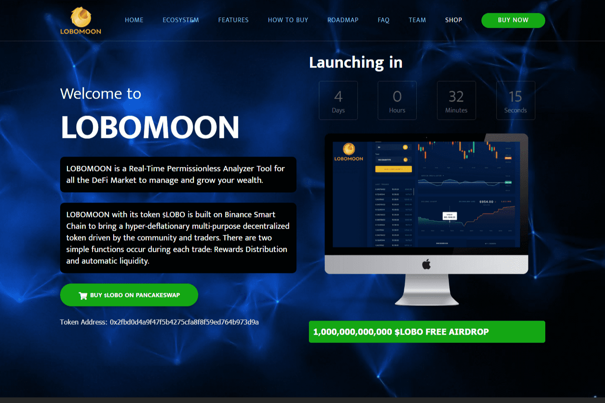

# Lobomoon

关于我们
LOBOMOON 是面向所有 DeFi 市场的实时免许可分析工具，专注于识别诈骗和高风险代币，以防止加密货币投资者遭受金钱损失。
此外，lobomoon 将提供您对代币所需的深入分析见解。
LOBOMOON 及其代币 $LOBO 建立在币安智能链上，带来由社区和交易者驱动的超通缩多用途去中心化代币。每笔交易都有两个简单的功能：奖励分配和自动流动性。
LOBOMOON 成立于 2021 年，旨在通过利用智能合约的功能来保护加密行业的新人、投资者和交易者免受诈骗活动的侵害。
LOBOMOON 网络旨在成为最优秀和最受欢迎的实时应用程序，以打击 DeFi 世界中的诈骗活动。通过使用 $LOBO 代币，我们将提供一种工具，使用我们最先进的机制来识别和避免潜在的诈骗和高风险代币。我们拥有一项高级功能，可以免费检查实时数据图表、实时交易分析、钱包跟踪器、无需许可的 AMM 服务、智能合约审查和风险评级，以造福整个加密社区。
我们还将使用能够跨所有主要 DEX 进行交易的单一 UI，包括币安智能链、以太坊、tron、多边形和其他具有重要的完整链上活动、交易和分析平台的网络协议。

