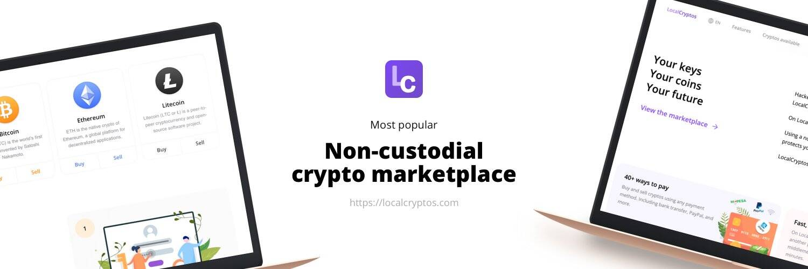

# LocalCryptos

LocalEthereum 是人们点对点交换 ETH 和其他加密货币的方式。

黑客每年从中心化交易所窃取数十亿美元。几乎每周都会发生新的百万美元抢劫案。

非托管平台不受这些威胁的影响，因为它们不持有用户的私钥。在 LocalCryptos 上，用户相互交易——而不是与我们交易。

LocalCryptos 使您能够使用由智能合约提供支持的非托管钱包和非托管托管系统来买卖加密货币。

尽管 LocalCryptos 更加安全，但我们以一种外观和感觉类似于普通托管平台的方式构建它——因此您无需成为专家即可进行交易。

使用非托管点对点市场意味着我们不会持有您的加密货币的密钥——即使在托管期间也是如此。

