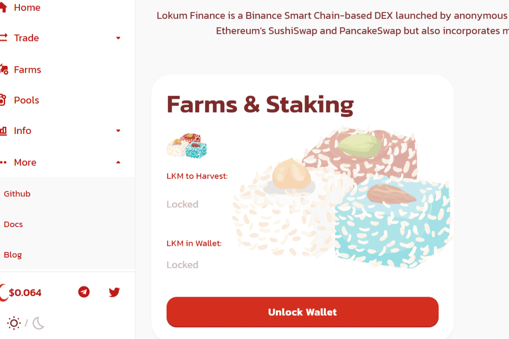

# Lokum Finance

LokumFinance 是一个自动化做市商 (AMM) — 一种去中心化金融 (DeFi) 应用程序，允许用户交换代币，通过农业提供流动性并赚取费用作为回报。
它于 2021 年 4 月推出，是一个去中心化交易所，用于在币安智能链上交换 BEP20 代币。 LokumFinance 使用自动做市商模型，用户在流动资金池中进行交易。这些池由将资金存入池中并获得流动性提供者 (LP) 代币作为回报的用户填充。
这些代币以后可以用来收回他们在池中的份额，以及部分交易费用。
LokumFinance 允许用户交易 BEP20 代币，为交易所提供流动性并赚取手续费，质押 LP 代币赚取 LKM，质押 LKM 赚取更多 LKM，质押 LKM 赚取其他项目的代币。

