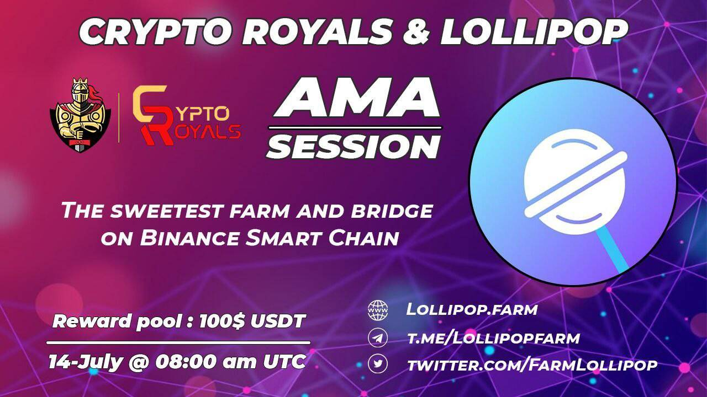

# Lollipop.farm

Lollipop 是币安智能链上的 100% 去中心化多链农场和跨链桥接协议。 Lollipop Bridge 建设完成后，Lollipop 协议将注入 100 万美元流动性作为初始流动性，其中 500,000 美元流动性在币安智能链上，另外 500,000 美元流动性在以太坊上。 Lollipop Bridge 将收取 0.5% 的费用作为团队的资金支持。

