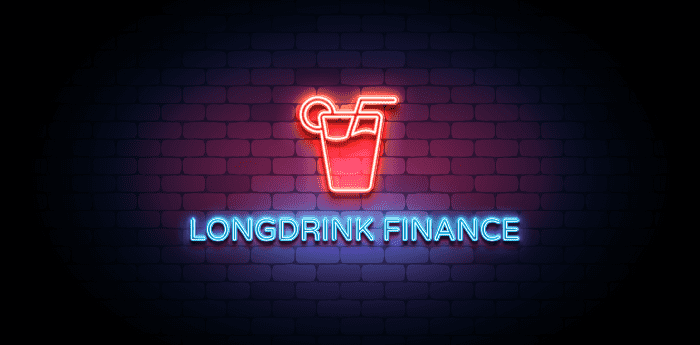

# Longdrink Finance

longdrink.finance 在币安智能链上创建指数代币。因此，投资者可以轻松访问一套 Binance Smart Chain 代币。
LONG 是协议的治理代币，使持有者能够决定未来指数的组成及其权重，以及协议内的费用捕获。
第一个指数称为 BEV - 币安生态系统价值，由十个币安智能链蓝筹股（BNB、CAKE、BAKE、XVS、BCTST、TWT、SFP、EPS、ALPACA、NRV）组成。持有 BEV 意味着您持有上述所有代币的少量股份。
