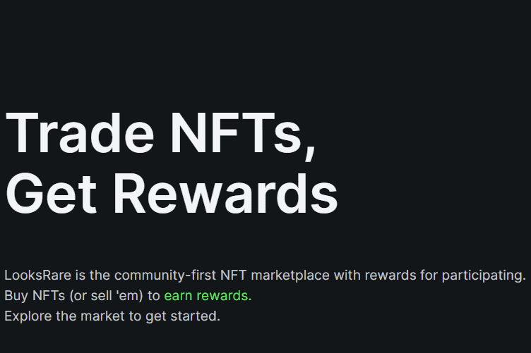

# LooksRare

作为社区第一的一部分意味着 LooksRare 奖励、授权并回馈平台的用户和创作者。

  💎 获得奖励 - 从符合条件的收藏中购买或出售 NFT 的用户可以获得 LOOKS 代币。
  🤝 分享平台费用 - 100% 的交易费用由 LOOKS 质押者赚取。
  ⚡️ 创作者立即获得报酬 - 创作者在销售时获得版税。

LooksRare 的智能合约是在模块化系统中定制构建的，借助明确定义执行范围的标准化签名，可以在不影响安全性的情况下随着时间的推移推出新功能。
这意味着我们可以提供新的交互类型，例如（即将推出）：

  集合报价 - 提供涵盖所选集合中所有 NFT 的报价
  特征报价 - 提供购买集合中具有特定特征的任何 NFT，例如BAYC w/金色毛皮
  多次取消 - 在一次交易中取消多个未结订单

