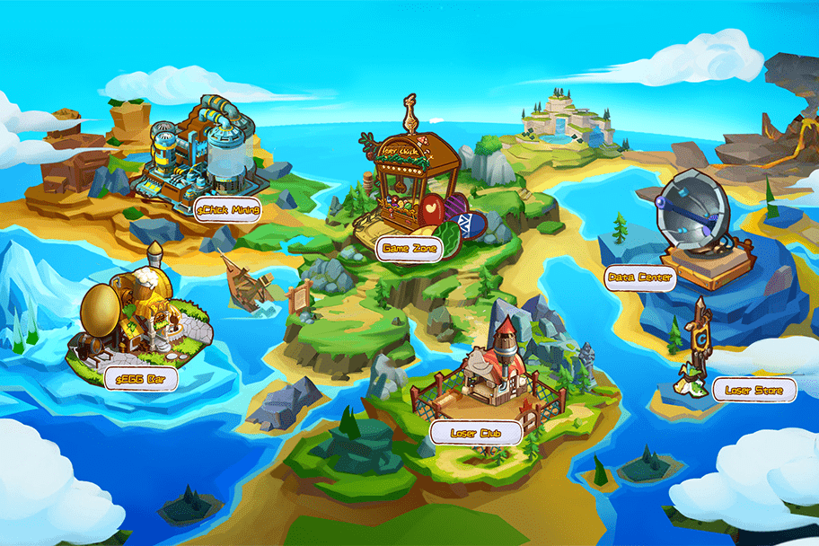

# LoserChick

LoserChick是全球首款3D“爪鹤”链上游戏，在游戏的基础上融合了NFT和GameFi金融玩法，如流动性挖矿、NFT铸币、NFT权益挖矿、资产交易等。
在LoserChick，玩家不仅可以自由地玩游戏，还可以持续享受各种金融服务，边玩边赚钱。
此外，LoserChick在经济模型设计上也有得天独厚的优势，采用“Dual-token & NFT”的创新设计和全球首个“Buring deflation & Dual deflation”机制，实现最极致的通缩效果和可持续增长游戏的经济价值。
LoserChick 由 Emoji DAO 构建，这是一个分散的自治组织，成员来自世界各地。
作为加密世界的早期支持者，他们为 LoserChick 走到了一起，每个人都利用自己在游戏设计、经济模型设计、智能合约编写和营销运营方面的能力来创建这个完全基于社区的新 GameFi 和 NFT 平台。
LoserChick游戏团队曾开发过一款DAU为10W、MAU为50W、注册人数百万、月收入2000万的中心化“爪鹤”游戏，位居同类型游戏前列。

