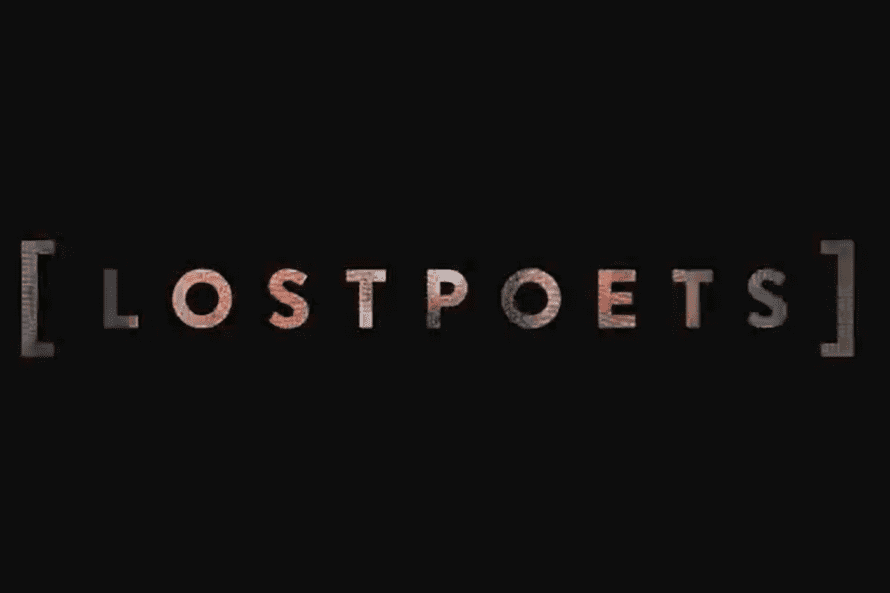

# LOSTPOETS

Lost Poets 是一款 NFT 收藏品和策略游戏。 NFT 集合包括 65536 个可获取的 NFT 和 1024 个 Origin NFT。该项目的发布分为几个阶段。有关详细信息，请参阅秘密路线图。
很久以前，在巴别图书馆，一个房间满是灰尘的书架上放着 65536 位诗人，他们都在等着被发现。在这个分形迷宫中，这些来自 1024 个不同起源的被遗忘的诗人在他们隐藏的 256 个自我之间漫游。
