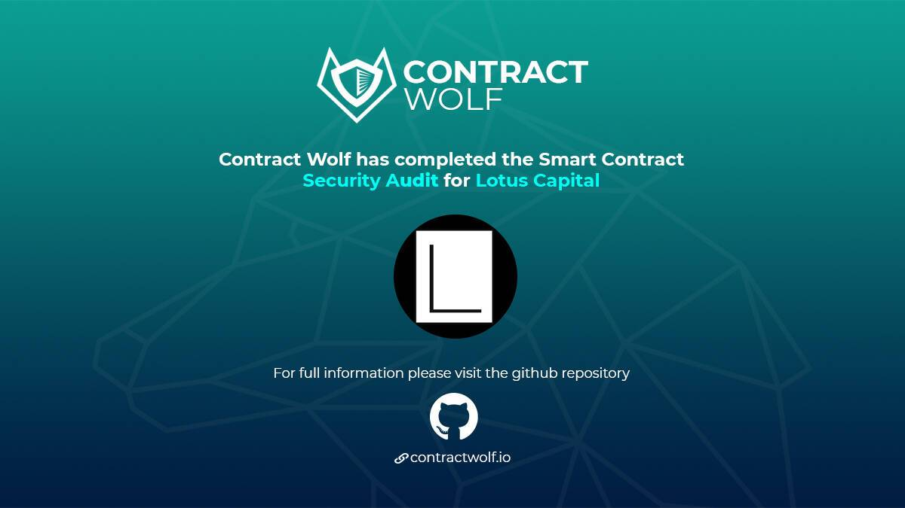

# Lotus Capital

对于没有能力通过传统方式创收的小企业来说，筹集资金通常似乎是一项不可能完成的任务。像大多数企业一样，小企业需要筹集资金来为其日常运营提供资金。然而，与大型企业不同的是，许多小企业通常无法获得替代资源（例如传统银行或风险投资公司）。缺乏替代资金可能会迫使企业家寻找更具创造性的方式来获得急需的启动资金。许多企业主可能选择通过家庭成员、有影响力的人脉或金融机构借入启动资金，这给他们的个人和职业福祉带来了各种压力。 Lotus Capital © 是一家去中心化的加速器和风险基金，其使命是帮助早期公司获得第一轮风险投资资金。我们通过提供必要的专业知识、指导和资金来帮助我们的客户，以实现他们的长期财务目标。营销在任何业务的发展中都起着重要作用。 Lotus Capital © 提供多种营销服务来协助更广泛的加密社区。我们的服务旨在帮助您在快速变化的去中心化金融环境中利用关键的增长机会并增加您的市场份额。 Lotus Capital © 可以通过我们一系列的加密营销服务帮助您吸引更广泛的受众。

