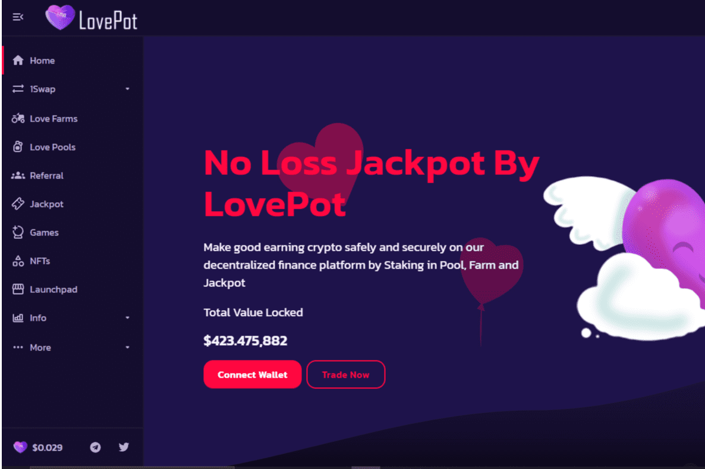

# LovePot

LovePot 是一种无损“累积奖金”池，类似于 Pool Together 开创的服务。用户在初始质押期间（例如前 24 小时）将代币质押到 LovePot。在这个初始阶段结束时，Pot 关闭以进行进一步的质押，并且在接下来的 6 天（耕种期），Pot 耕种所有集合资产以产生集合收益。 （注意：从技术上讲，LovePot 在质押后立即开始质押，但为了简单起见，我们将接下来的 6 天称为质押结束后的 6 天）。在农场期结束时，根据他们贡献给 LovePot 的代币数量乘以速度倍数 (S) 和历史倍数 (H) 的综合权重，随机选择一名用户作为获胜者（这样综合权重 = # Tokens X S X H)。

