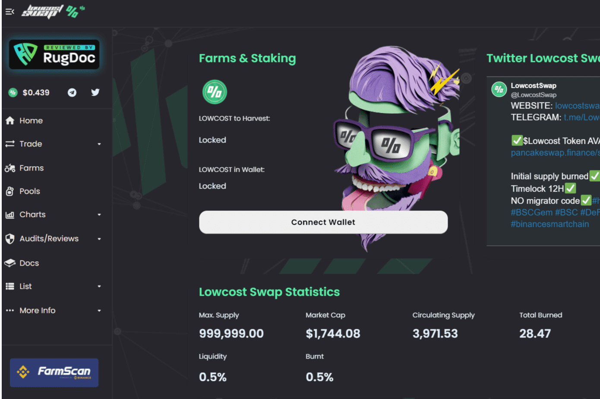

# Lowcostswap

建立在币安智能链上的最实惠和最赚钱的 Yieldfarm。收益耕作是代币持有者在各种 DeFi 平台上最大化奖励的过程。单产农民为各种代币对提供流动性并获得加密货币的奖励。
最近，这类投资平台出现了一系列新的功能和机制，试图吸引新的投资者，但最终，大多数都没有符合最初的预期，同时也体现了真正的农业经验。大多数用户甚至不知道它的用途或如何使用它，官僚主义已经消失了。
在 Lowcostswap，除了选择非常低的存款费用和几乎零转账费用外，我们还选择保持去中心化金融的开创性理念，保持简单！原生代币：$Lowcost 供应量：4000 Lowcost MAX 供应量：999.999 Lowcost

