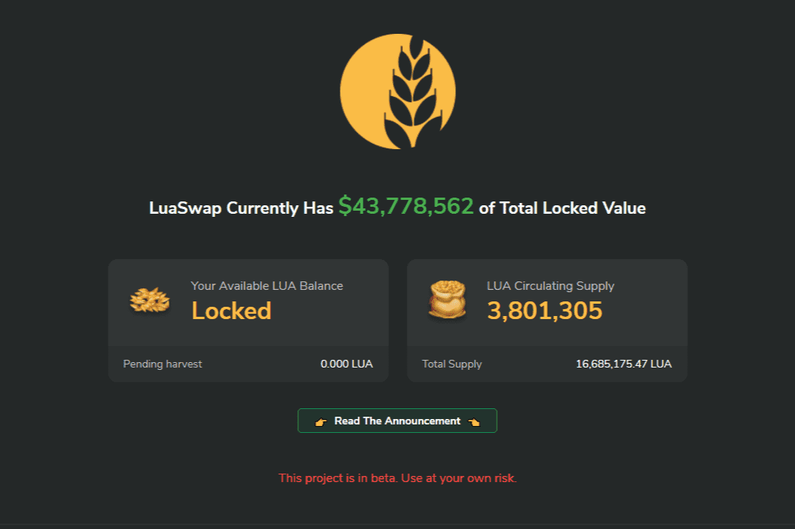

# LuaSwap

AMM 池已成为 DEFI 中一个非常重要的加密原语，它不仅可以列出和交易代币，还可以提供其他项目可以构建的价格信息。 LuaSwap 是受先前基于 AMM 的交换协议（如 Uniswap 和 SushiSwap）启发的新交换协议。然而，LuaSwap 重新设计的代币经济学和运营策略解决了其他交换系统的缺点。 LuaSwap 的核心是通过 LUA 代币提供社区管理的多链协议。重点是支持较小的新兴代币池，而不是在顶级代币池中争夺流动性。此外，LUA 的代币经济学经过重新设计，具有归属时间表，不仅可以奖励早期采用者，还可以激励他们在更长的时间内留下并参与治理。该协议将公平发布，无需种子投资、创始人费用或预挖。

