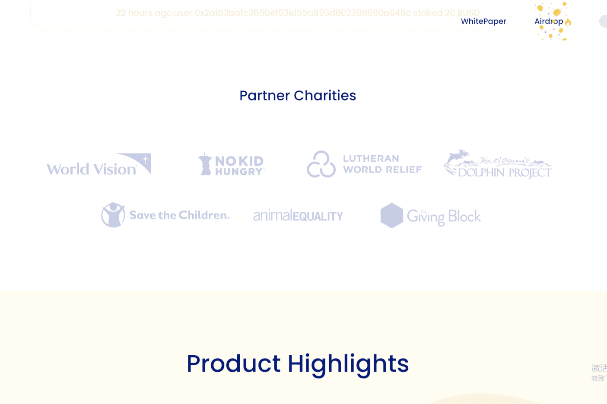

# LuckTogether

LuckTogether 是一个开源和去中心化协议，用于无损奖金游戏和挖矿，由 LUCK 代币持有者管理。
LuckTogether 希望打造一种能够让所有人受益的幸运抽奖模式。收集小资产组成奖池，一起赚取红利，然后抽奖。在这种模式下，每个人都永久有资格免费参与游戏并通过运气赚取财富。资产集齐后，我们希望能将其中的一部分用于帮助有需要的人，让幸运的种子播种到世界的每一个角落。让阳光温暖世界的每一个角落，我们永远期待美好的未来！

