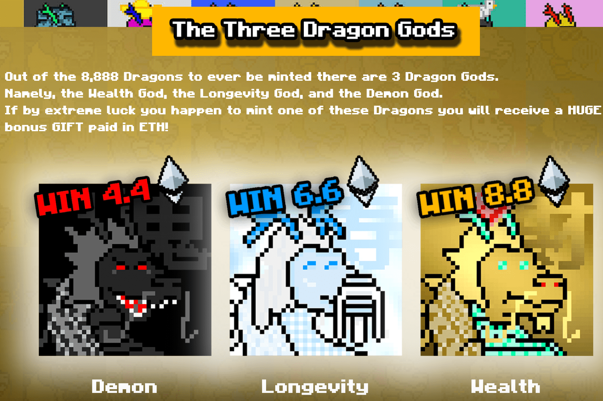

# Lucky Dragons

幸运龙是以太坊网络上随机生成的 8,888 条龙。每条龙都被结合到一个实际分配的元数据中，这些元数据会影响它的背景、颜色、皮肤、配饰和稀有度。有些龙比其他龙稀有得多。所有二次销售的1%将用于扫地和烧龙，使剩余的更加稀有。社区抽奖和彩票不会让人失望。访问我们的网站以获取完整的实用程序和路线图。加入我们的 Discord 并进入 Dragon Lair 以获得独家赠品。

