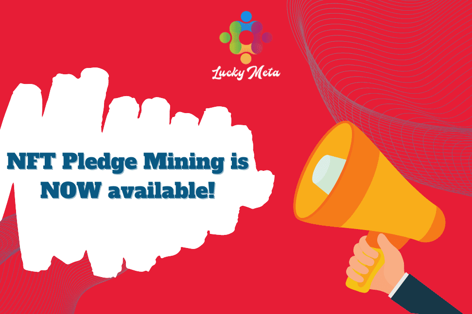

# LuckyMeta

LuckyMeta 是一个免费的赌场元宇宙，运行在智能合约上，由去中心化自治组织 (D.A.O.) 管理。
LuckyMeta 的使命是用最新的区块链技术改造游戏行业，打造一个自动运行、没有老板、公开透明、惠及所有人的去中心化赌场。
LuckyMeta 的愿景是成为娱乐性最强、用户最多、游戏内容最丰富的元宇宙。 LuckyMe从小游戏开始，逐步引入各种故事情节，并结合其独特的VR设备，成为最好的元宇宙体验。
LuckyMeta 平台将有两种代币在流通。
LuckyMeta Gold (LMG) 是游戏币通证，通过每日奖励分配给用户。将有 100 亿个 LMG 代币在流通。
LuckyMeta 代币（LMT）是平台的治理和权益代币。将有 1 亿个 LMT 代币在流通。

