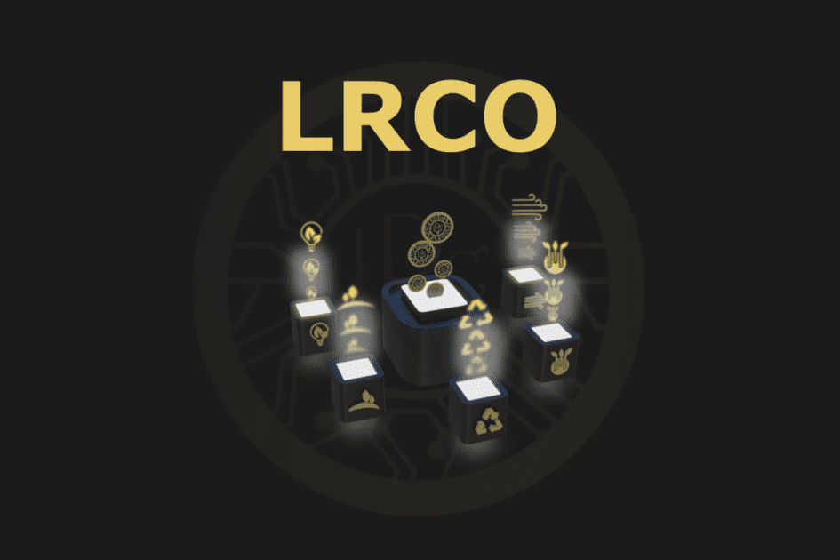

# Luxury Royal Coin

Luxury Royal Coin (LRCO) 是一个可持续发展环境的生态链平台。生态链为能够对解决现代生态危机和自然环境污染、回收利用和生态产品开发等问题产生影响的创新项目提供支持。可靠地实施环保创新，以建设更美好的未来。 LRCO 专注于环境、经济和社会可持续性的创新动态。
Luxury Royal Coin (LRCO) 生态链平台是一个区块链空间，设计师和发明者在其中开发新想法并实施有效的想法。作为区块链空间，Luxury Royal Coin (LRCO) 有一个发行人来实施其开发。我们以您持有的每个 LRCO 代币为代价，开发解决全球必要任务的项目和产品。
Luxury Royal Coin (LRCO) 生态链平台旨在通过选择最佳的可持续发展导向创新来开发有益于环境的有用和必要的项目、产品和服务。
我们的生态链是在基于创新的研究之后开发的，旨在通过设计解决方案应对未来的环境挑战和可持续性。我们的愿景是“突出并倡导可持续发展”
开发面向环境的创新和发明。专注于基本的全球问题并找到解决方案。我们的目的是在每个创新项目中为自然环境做出可衡量的贡献。我们的目标是引领行业解决世界能源问题，为所有人营造一个安全的环境。
