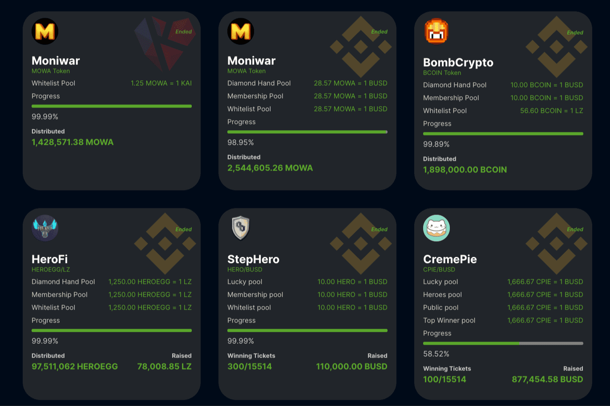

# LZ Pad

共有四轮IDO，让更多的投资者参与到LZ Pad主办的代币销售活动（IDO）中。
每一轮的设计如下：
钻石手轮
在新的分配方案中，每个在 LZ Pad 上锁定 $LZ 的人都可以根据他们锁定的门票份额按比例申请分配。因此，我们将这一轮的名称改为钻石手轮。 $BSCX 门票持有者仍有资格参加即将到来的 IDO。
会员回合
LZ Club、BARMY Club 和 Mayor Club 的会员必须在 LZ Pool 上存入最低数量的 LP 代币加入 Telegram 群。如果他们撤回他们的 LP 代币或他们的余额低于要求的最低限度，用户将自动从组中删除，并且没有资格获得 IDO。
每个组都需要存入不同的 LP 对：
LZ俱乐部：将LZ/BUSD货币对存入LZ矿池即可加入俱乐部。BARMY俱乐部：将LZ/USDC货币对存入LZ矿池即可加入俱乐部。市长俱乐部：将LZ/USDT货币对存入LZ矿池即可加入俱乐部这里的俱乐部。
白名单轮
我们将选出白名单挑战的获胜者，并在 IDO 之前公布名单。白名单获胜者池将在第二轮结束后开放。如果钻石手轮和会员轮的分配在给定时间内没有完全分配，剩余的代币将分配给白名单轮的参与者。
英雄回合
LZ英雄可以参与最后一轮的IDO，其池是手动分配的。我们将在 IDO 开始前一天公布列入白名单的英雄地址。 LZ英雄需要填写附件信息表，等待白名单回合结束后手动分发。英雄回合的平均个人分配为 50 美元。

