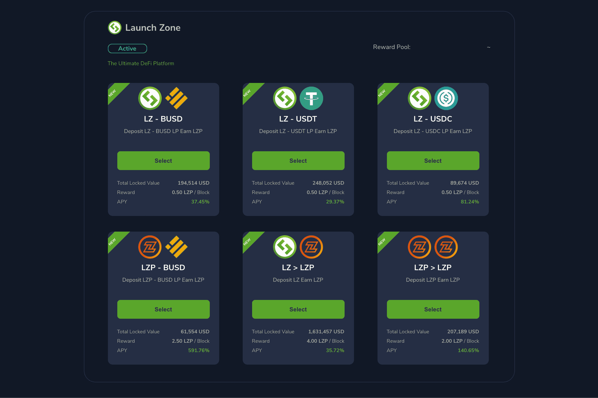

# LZ Pool

LaunchZone 生态系统自豪地宣布推出我们的 LZ 池，这是在多链上投资 dApp 的最复杂的加密货币之一。
用户可以质押他们的代币和/或为 LZ Swap 提供流动性以赚取新的代币。每日奖励的数量，即每日赚取的新代币，与每个用户在池中的份额成正比。收益农场是最好的 DeFi 功能之一——你知道你不会错过它。
LZ Pool目前支持对Staking和Single Staking，随着LZP的上线，新的矿池将会增加。 LaunchZone 旨在让 DeFi 更接近日常使用，因此在完善我们与这些网络的桥梁后，将能够在 Polygon、Kucoin Chain、Hecochain 和 Avalanche 上进行农业。
LaunchZone 通过合作伙伴关系不断增加新的矿池，以新用户为目标，同时为现有用户提供更多的质押选择。
LZ Pool目前支持LZ Wallet、Metamask、Trust Wallet、Coin98 Wallet和开源协议WalletConnect。

