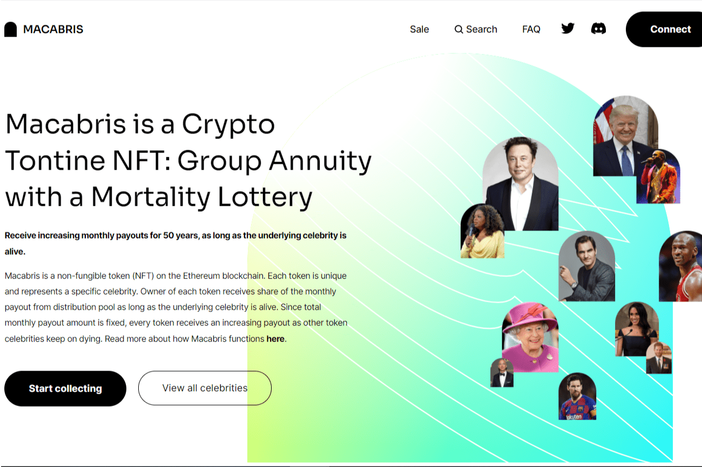

# Macabris

Macabris 是有史以来第一个加密联合养老保险 NFT：团体年金和死亡彩票。只要潜在名人还活着，代币的所有者就会收到越来越多的每月支出。联合养老保险是一种筹集资金的投资计划，设计于 17 世纪，在 18 世纪和 19 世纪相对普及。联合养老保险通过将团体年金的特征与一种死亡彩票相结合，使订户能够分担长寿的风险。每个订户向基金支付约定的金额，然后定期收到付款。随着成员死亡，他们的支付权利将转移给其他参与者，因此每次持续支付的价值都会增加。最后一名成员去世后，该计划就结束了。
大约每个月都会向代币持有者支付一部分分配池。该池分 600 期分发。每 30 天将自动支付一笔款项并分发给活着的代币持有者。示例：假设池中有 100 个 ETH 和 100 个活着的名人代币。每月支付为 1/600 * 100 = 0.1667 ETH，每 100 个活着的代币分配。因此，每个代币自动收到 0.1667 ETH / 100 = 0.001667 ETH 每个代币。假设，一个月过去了，5 个名人走到了尽头。总共有 95 个活着的令牌。每月的总支出是相同的——0.1667 ETH，但它是在活代币之间分配的。每个活着的代币现在自动收到 0.1667 / 95 = 0.00175 ETH。最终，随着时间的流逝，越来越多的名人死去，最后剩下的活着的令牌将每月收集整个池的支出。

