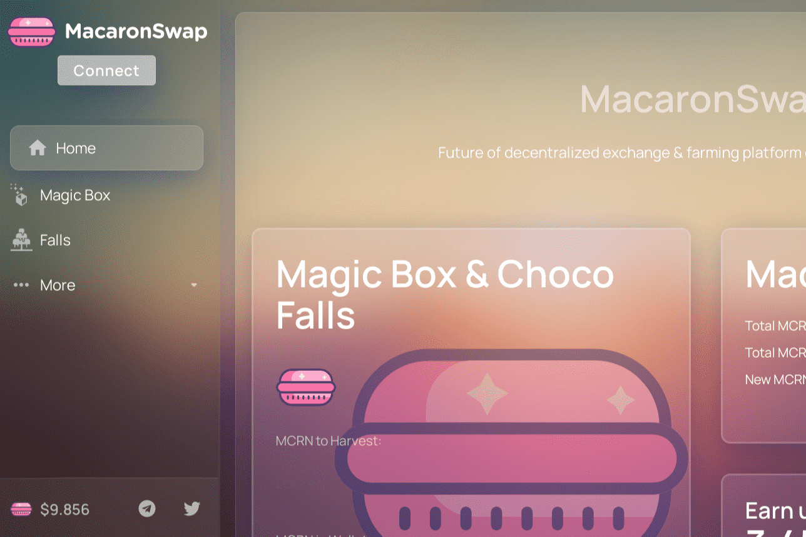

# MacaronSwap

MacaronSwap 是一个农场和去中心化的跨链交易平台。
MacaronSwap 使用基于币安智能链的自动做市商（AMM）模型。 AMM 意味着虽然您可以在平台上交易数字资产，但没有订单簿可以让您与其他人匹配。相反，您使用流动资金池进行交易。这些池中充满了其他用户的资金。他们将它们存入池中，并获得流动性提供者（或 LP）代币作为回报。他们可以使用这些代币来收回他们的份额，以及部分交易费用。
梦想？
在 MagicBox 中种植您的 LP，或在 Choco Falls 中质押您列入白名单的 BEP20 代币以赚取代币。

