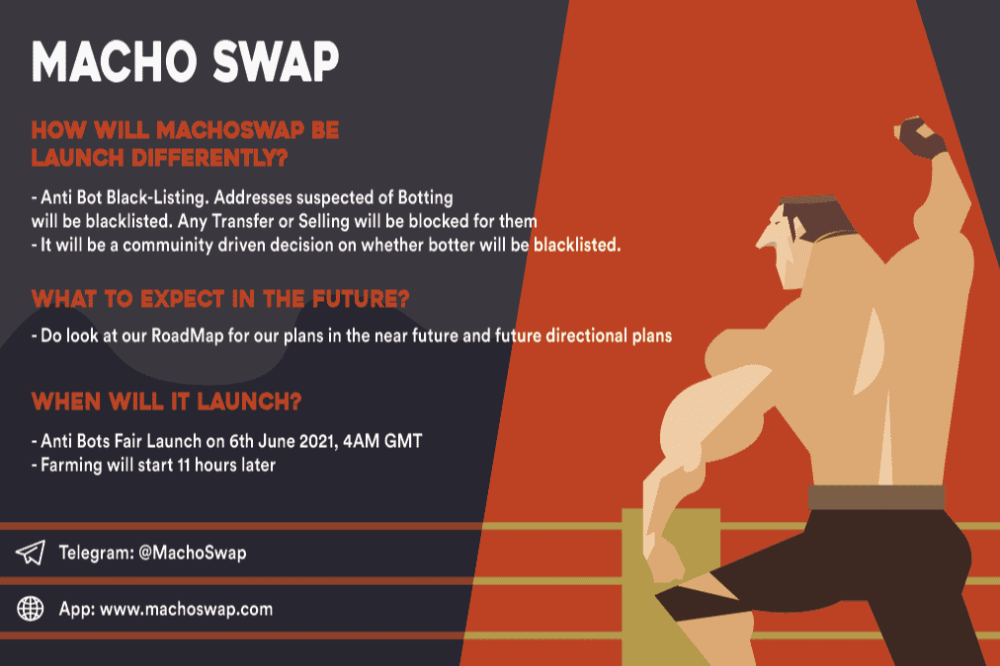

# MachoSwap

自动流动性添加 (MACHO-BNB) 自动减排‌ 反鲸
Machoswap 是基于币安智能链的自动流动性获取收益农场和 AMM 去中心化交易所，具有多种创新功能，可让您在今年夏天赚取和增加您的投资组合。
MachoSwap 完全支持使用 CAKE-LP v2 进行质押。
‌
随着我们深入研究我们的项目，我们将详细说明这些功能：
转让税（自动流动性+自动销毁）
‌
MACHO的每次转让必须缴纳5%的转让税。 4% 的转让税通过合约自动添加到流动性池中，以不断提高价格下限。流动性将被烧毁，无法获得。
‌
‌自动燃烧 MACHO
正如我们上面提到的，每笔 MACHO 的转让都必须缴纳 5% 的转让税。
为确保我们获得所需的 MACHO 身体，其余 1% 的转让税将自动燃烧，就像我们希望我们体内的卡路里自动燃烧一样。
‌

