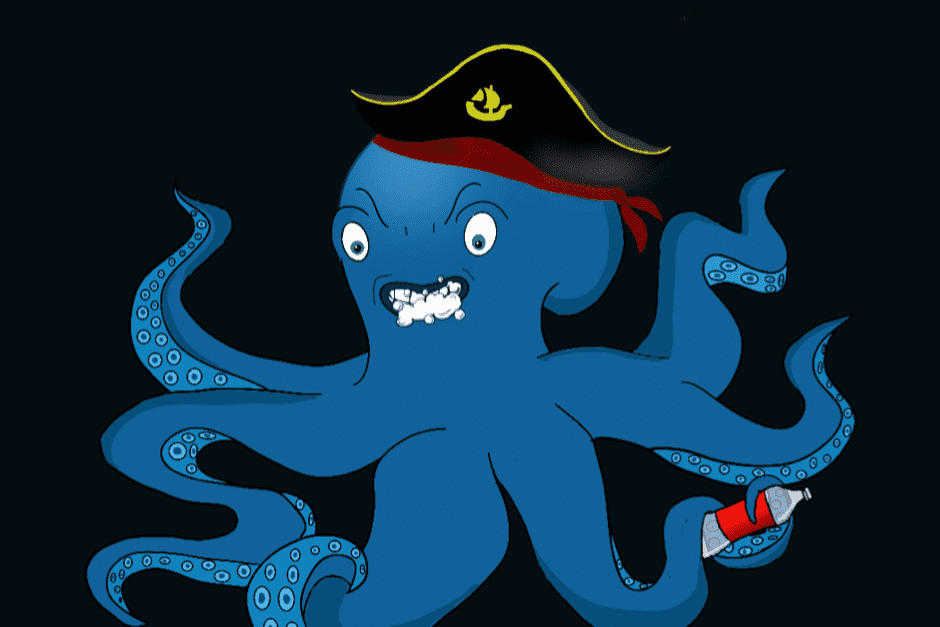

# Mad Octopus Diving Club

我们是疯狂章鱼潜水俱乐部🐙，我们开创了环境可持续的 NFT。

  原因：每天有 800 万件塑料件污染我们的海洋。🌊
  内容：因此，我们创建了 MODC 来提高人们对这个问题的认识，并为清除海洋塑料的非政府组织捐款。
  如何：

  通过 NFT 销售的所有收益的 70% 将捐赠，30% 将用于营销和开发成本。
  我们正在透明地传达我们想要支持的 NGO 以及 MODC NFT 的持有者将决定对这些 NGO 的捐款分配方式。有些非政府组织接受加密货币捐赠，因此捐赠将在区块链上透明且可见。
  最重要的是，每个 MODC 的环境影响也将存储在区块链上，通过购买时的 ETH 价格以及对 NFT 的额外捐赠来计算，这将增加影响，并得到科学论文的支持。从海洋中清除 1 公斤塑料的成本。
  持有者和疯狂章鱼潜水俱乐部的成员将有资格：对捐赠的分配进行投票，接收由海洋塑料制成的产品等赠品，参与影响力挑战以赢得奖品，以及我们路线图中描述的更多内容。

