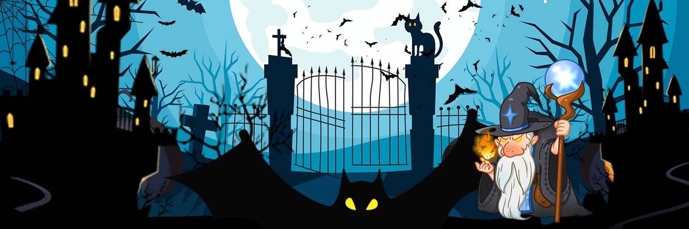

# Magician

睁开眼睛，你会发现自己置身于一个神奇的世界，魔法球、魔药、水晶和其他未开发的元素是日常的秩序，那些善用它们的人会受到当地居民的尊重并被称为“魔法师”。如果你想在这个世界上生存下去，你需要学习魔法，收集魔法元素和道具。
在这个世界中，Magic Ball Token (MBT) 是核心资产。巫师可以通过 MBT 和 NFT 获得财富和其他神秘力量。魔术师元宇宙建立在多边形大陆上。但是我们魔术师通过许多史前恐龙居住的神奇隧道与另一个世界保持联系。
在这些恐龙的帮助下，我们建立了魔术师的原始魔法世界。双方结成了紧密的联盟。

