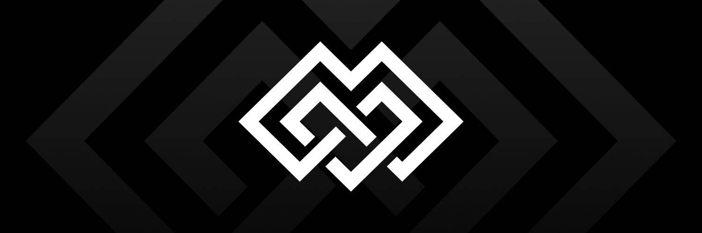

# MAIN

MAIN 是一个由其用户拥有和运营的加密社交网络。
平台上的每个社区都有自己的代币，任何人都可以买卖。当人们购买硬币时，硬币的价格会上涨，而当人们卖出时，硬币的价格会下跌。
在 MAIN 上，您可以：

  做所有与其他社交网络相同的事情：发帖、评论、评价其他用户、创建自己的社区或加入现有社区。
  为您在平台上的活动或其他用户的奖励获取 MAIN 代币。令牌每天都分发给所有主要用户。
  在区块链上拥有自己的社区。您可以买卖社区币，参与投票并在社区发展中赚钱。
  从平台上提取代币并将其兑换成其他加密货币。

