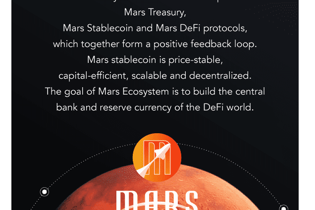

# Mars Ecosystem

火星生态系统通过将稳定币的创建和使用整合到一个稳定但去中心化的生态系统中来解决这个问题。 Mars Stablecoin 与 Mars DeFi 平台之间的关系创建了一个正反馈循环并产生了飞轮效应。火星生态团队成员都是互联网和区块链的早期实践者，具有特别深厚的金融背景。毕业于斯坦福大学、巴塞罗那大学等名校，团队拥有多年跨终端能力、金融背景和成熟的DeFi行业经验。最重要的是，他们对区块链技术和Defi都有坚定的信念和远大的愿景！

