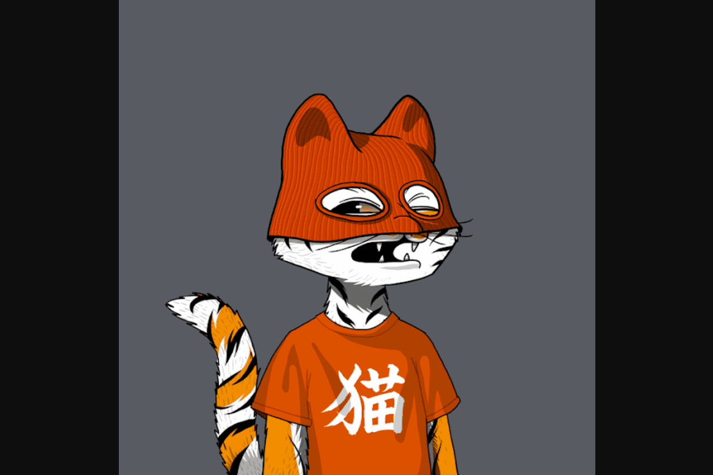

# MarsCatsVoyage

火星猫规格和事实

  每只殖民者猫都是独一无二的，一只被特别挑选出来参加探险的猫，并通过算法从 220 种独特特征中生成，例如发型、配饰、服装等等。所有的猫都很棒，随时准备飞翔，但一些更独特的猫却很少见；
  MarsCatsVoyage (M.C.V) 是在以太坊区块链上的智能合约 (ERC-721) 上发行的独特 NFT 代币 (10,000) 的集合。
  我们的价格公道。所有 10,000 只太空猫的价格将相同 - 0.05 ETH。
  猫的独特性由以太坊区块链上的智能合约（ERC-721）确认。所有发行的代币都将记录在出处页面上（参见出处表中的条目）。
  我们关心我们的猫殖民者。这就是为什么 10% 的二次销售将保留给社区池。

