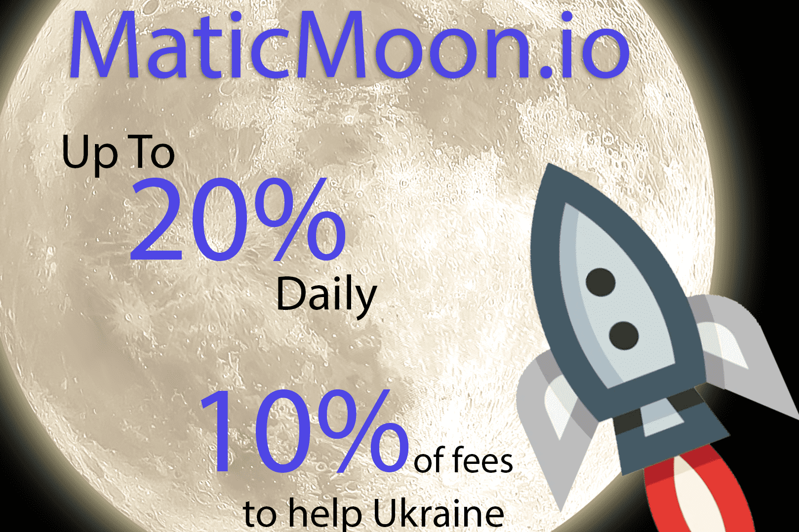

# Matic Moon

特征
MaticMoon 是为 Polygon 社区开发的高收益投资计划。该合约旨在奖励社区，尤其是在加密空间正经历剧烈市场波动的时候。
这是将 MATIC 投入收益回报并获得良好投资回报率的最佳时机。这是一个社区驱动的项目。我们鼓励社区的每个成员将其收益的一小部分进行再投资，以维持合约的生命周期。
这个 Defi 投资方案是非常安全的，合约已经过审计验证是 100% 安全的。包含这些功能后，合约将能够维持很长时间。
安全可靠的协议——由 Haze Crypto 审核

  最低存款 10 Matic，无上限。
  基本利率上调（仅限新存款）：每 24 小时 +0.5%
  总收入（根据您的计划）：每日 7% 至 8% + 基本利率（每日增长）
  收益每时每刻都在累积，随时提款，如果您使用利息资本化，您只能在存款投资计划结束后提款。我们有两种不同时期和盈利百分比的计划
  通过在特定计划框中输入您的投资金额，使用内置的奖励计算器预先查看您的预期投资回报率。
  与每个 Staking 计划一样，对开发人员可以获得的每项投资征收 10% — 6% 用于运行系统（我们的费用），4% 用于利润。

