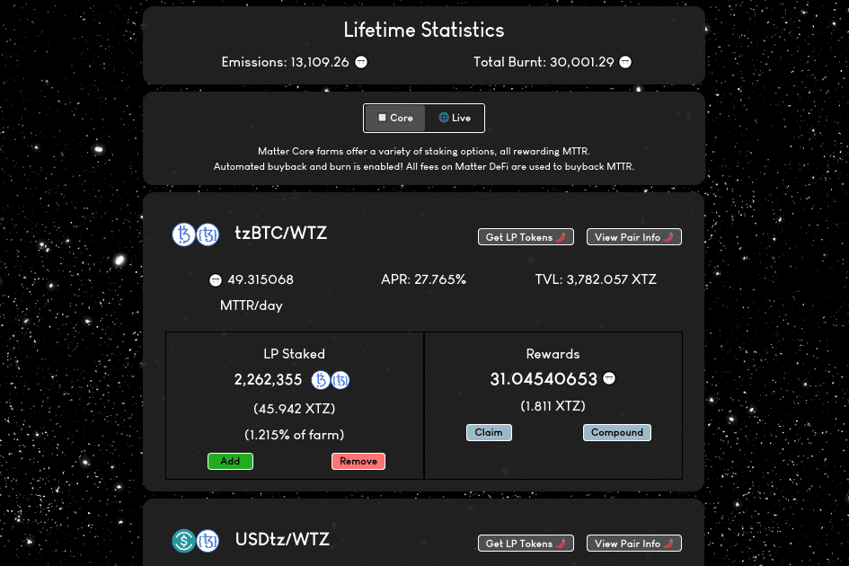

# Matter DeFi

Matter DeFi 是一个先进的单产农业平台，旨在为 Tezos 用户提供长期可持续的农业机会。
Matter DeFi 的旗舰功能是 $MTTR 代币的合约级别自动回购和销毁。平台产生的所有费用都会在 SpicySwap 上自动回购并销毁。自动回购确保 MTTR 存在持久的购买压力，从而实现真正可持续的收益率。高级合同级自动化支持这种交互。
Matter DeFi 还托管其他农业工具，例如农业即服务。用户可以创建自己的农场，或者找到更多的农场来参与！

