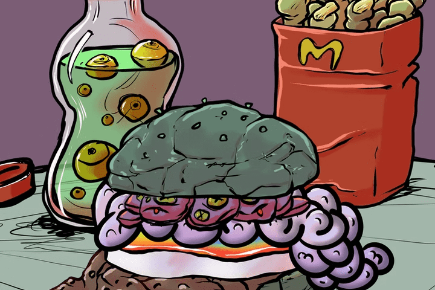

# mcgoblin.wtf

Mcgoblin.wtf 是原始 Goblintown.wtf NFT 项目的配套项目。

虽然包含有限的信息，但麦哥布林网站描绘了麦哥布林汉堡餐厅，其标志与麦当劳相似。

只需一个交互按钮，用户就可以点击“Wanna Burger？” 在右上角将它们带入餐厅，用户可以看到麦哥布林汉堡是用鞋子和神秘粘液等原料制成的。

与 Goblintown 类似，Mcgoblin NFT 是免费的，不包含路线图、discord 或任何实用程序。

该系列中有 11 个 1/1 NFT，这些是唯一没有饮料和侧面的物品。

什么是 mcgoblin.wtf？
7,800 nfts 收藏

mcgoblin.wtf 统计
该数据代表被跟踪智能合约的原始链上活动

