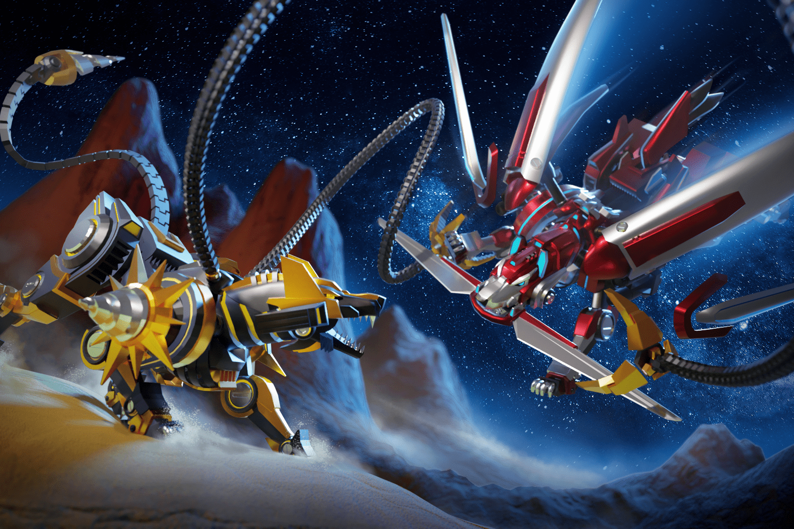

# Mecha World

一款关于在 WAX 区块链上建造、探索和与机甲动物战斗的后世界末日 NFT 游戏。
Mechas 是您的基础 NFT。在发布时，将有 36 种基于 Canine 体型和颜色的不同外观。您的机甲可以通过安装 Parts NFT 来增强。有各种各样的零件可用，其中一些还会在视觉上改变你的 Mecha NFT 的外观。
零件将有不同的稀有度。它们使您的机甲在战斗中更强大，并会增加您在任务中找到 NFT 的机会。

通过派他们执行任务或与其他玩家的 Mechas 战斗来升级你的 Mechas。
将您的 Mechas 发送到任务中将为他们赚取 XP，用于升级。在 XP 旁边，任务可以为您赢得一些 FGL 代币，甚至可能是 NFT，例如 Parts & Upgrades 或其他 Mecha。任务越长，收益越高。
我们将实施的第一个战斗模式是骰子战斗，它将测试您的战略技能。更多战斗模式等你来！
玩家也可以成为土地所有者。土地可用于建造车间和竞技场。通过让其他玩家使用您的工作室服务或让他们在您的竞技场中战斗来参与 Mecha World 经济。
Mecha World 是 FGL NFT 生态系统的一部分，使用 FGL 代币。 FGL 代币将作为我们整个加密游戏组合的货币。我们相信这会增加我们代币的价值和寿命，并有助于建立健康的经济。 Mecha World 是继 Cosmic Clash 之后在 FGL 生态系统中发布的第二款游戏。

