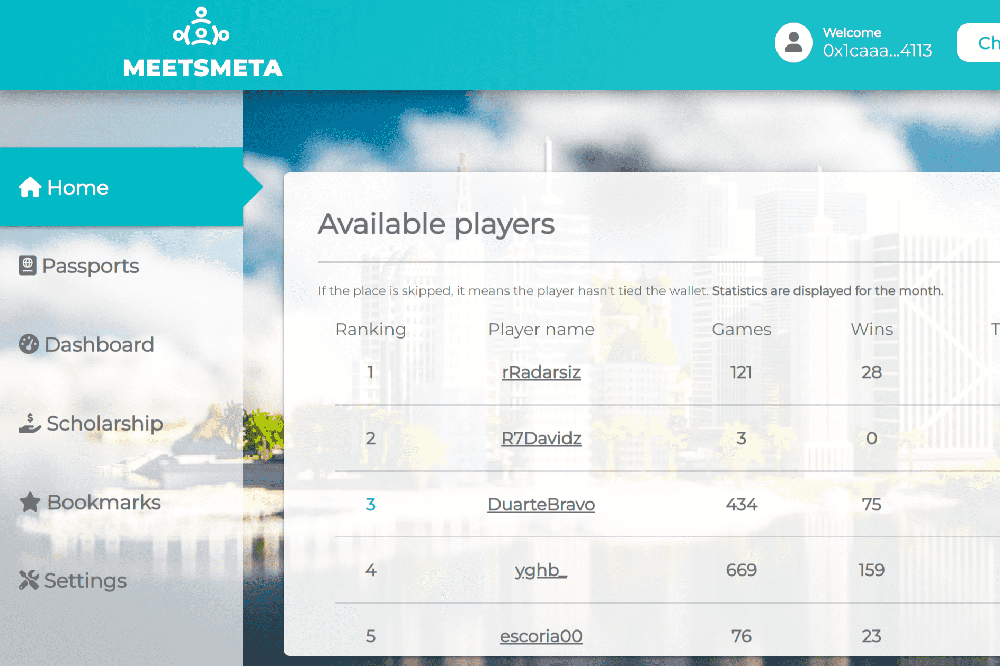

# MeetsMeta Scholarship Dapp

MeetsMeta Scholarship dApp 是一个平台，它让游戏社区能够分散 NFT 持有者和游戏玩家之间的互动，安全地为持有者提供被动收入，同时增加游戏玩家的收入和收益。
持有者可以根据他们的表现寻找游戏玩家，并向寻求奖学金的顶级玩家发送报价。同样，玩家也可以向持有者发送报价，并接受他们收到的报价。
在报价中，双方可以指定合同期限和收益分成百分比。一旦任何一方接受了要约，持有人就可以在区块链上签署合同，将他们的护照质押到指定的长度。
在 dApp 内，用户可以查看奖学金统计数据、通过电子邮件和 Discord 获取通知、为优惠添加书签以及提取收入。

