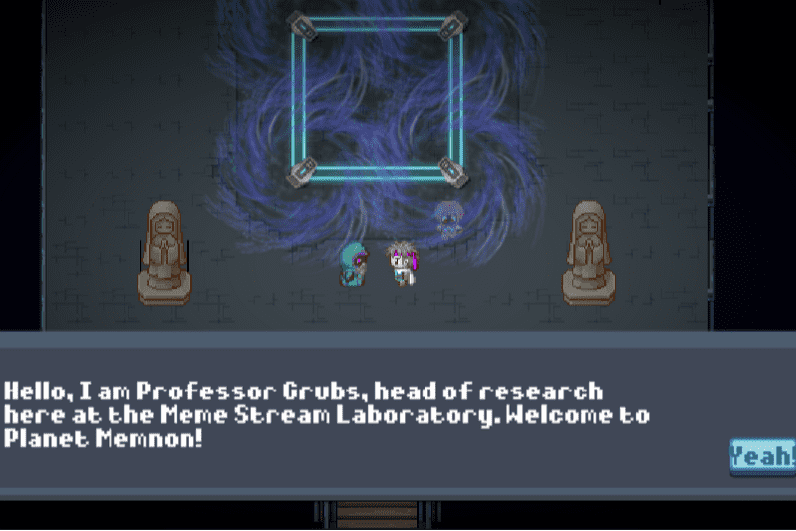

# Meme Lordz

Meme Lordz 是一款 100 多小时的区块链游戏，由币安智能链网络提供支持。探索怀旧的、自上而下的 Memnon 开放世界，并利用游戏内铸币将每个 Meme Lord 永生化为不可替代代币 (NFT)。穿越由人类集体思想形态驱动的神秘土地，战斗、绑定和收集！

在动态的回合制战斗系统中使用 300 多种独特的 Meme Lordz 的力量。玩家可以从 100 个可学习的动作中进行选择。每一步都来自 14 种亲和力中的一种，这些亲和力采用独特的游戏风格，以允许自由和实验战斗风格。

在游戏中遇到的每个 Meme Lord 都有一个与之相关的“基本稀有度”。有些 Lordz 比其他的更难找到……有些甚至更难进化！凭借复杂的多层次进化系统，玩家可以通过战斗和观看升级他们的 Meme Lordz，因为他们进化成强大的新的高级 Meme Lordz。有些是通过机会进化的，有些则是通过鼓励玩家实验和社区对话的特定条件进化而来的。

