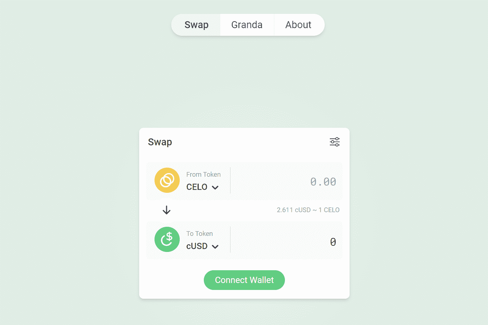

# Mento-fi

Celo 拥有稳定的价值资产，例如 Celo Dollar (cUSD)。 Mento 使这些代币的价值保持稳定。它还提供了一种交换，因此任何人都可以在本地资产之间进行交易。Mento-Fi（简称：Mento Finance）是 Celo 生态系统中最突出的产品之一。众所周知，Celo 现在已经发布了一个稳定币原始名称为 cUSD。Mento-Fi 在维持这种稳定币的价值方面发挥着至关重要的作用。

随着对稳定币的需求增长，Celo 将铸造 cUSD 并通过 Mento-Fi 出售它们以换取 CELO 代币。可以说，Mento-Fi 是 Celo 与加密用户之间稳定币交易的“桥梁”。新的 CELO 代币将作为铸造 cUSD 的抵押品存储。当然，随着对稳定币的需求减少，这个过程将会逆转

