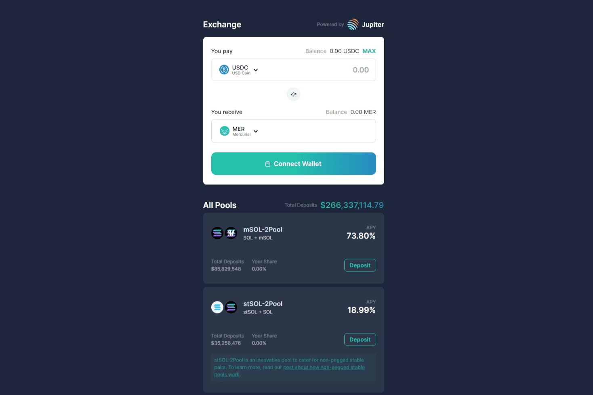

# Mercurial

Mercurial 正在建立新的流动性系统，以最大限度地提高 Solana 上稳定资产的效用和收益。
我们为 Solana 带来的一些创新：
动态保险库
动态做市库以最大限度地利用资本
交换池
与 Solana 的第一个多代币交换池进行低滑点交换，用于挂钩和去挂钩的马厩
机构金库
通过动态向机构合作伙伴借出流动性以进行做市，从而产生有保证的收益
建设最好的教育社区
Mercurial 正在通过社区资助计划、激励性测验平台和 NFT 激励措施来建立 DeFi 上受过良好教育的社区，以促进 DeFi 学习

