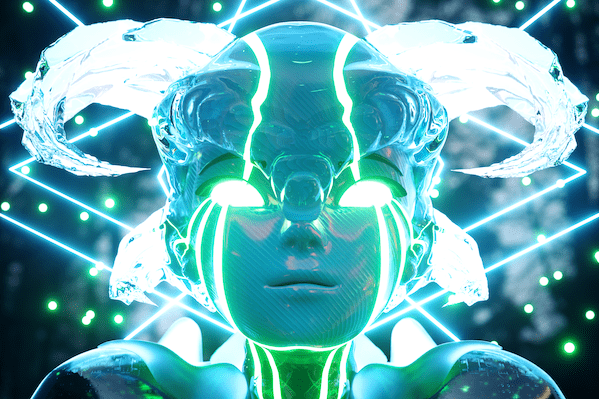

# Meta Legends

Meta Legends 代表 12345 个图例的集合，按稀有程度分类，并由数百个元素生成。 Legends 作为 ERC-721 代币存储在以太坊区块链上并托管在 IPFS 上。我们的目标是创建一个完整的生态系统。首先，我们正在开发一个应用程序（Meta-Connect），它将连接我们所有的社区成员。您将能够在地图上找到彼此，存储您的 NFT 并估算其价值。然后，我们将开发我们自己的元宇宙（Meta-Life）。在这个 Metaverse 中，您将能够堆叠密码、拥有财产、物品并探索 Meta Legends 宇宙。我们对 Meta Legend 的抱负是创建一个娱乐许可证。

