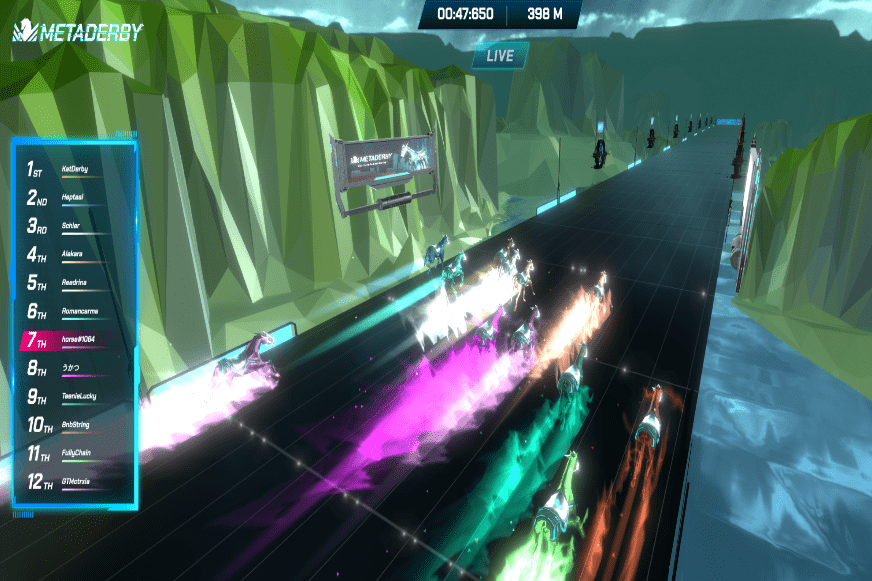

# MetaDerby

MetaDerby 是一个通过游戏赚取的 NFT 赛马虚拟世界，玩家可以通过 Avalanche 上的免费游戏功能赚取代币和真钱。在 MetaDerby 中，玩家可以参与赛马、马匹繁殖、购买土地和在土地上建造以培育独特的马匹或举办比赛。
每匹赛马都是一个不可替代的代币 (NFT)，具有四种基因型：血统、加速（基因 X）、侵略性（基因 Y）和冲刺速度（基因 Z），其中每种基因型代表马的潜在能力。他们可以参加一场比赛，总共有 12 匹马将在一场比赛中相互竞争。这些赛马可以培育出新的后代，可以在 MetaDerby 市场或任何其他 NFT 市场中使用或出售。
免费模式：新手可以通过完成任务免费获得一匹马参加比赛，对新玩家更加友好。 F2P 模式将是一种高效的用户获取方式。
双通证模式，玩法更多样化：MetaDerby采用双通证模式——治理通证$DBY和游戏通证$HOOF 在MetaDerby游戏中，玩家可以参与多种玩法获取收益，包括赛车、育种、预测和土地系统。我们的游戏机制产生了更加动态的游戏经济学并推动了用户参与度。
创收模式：从长远来看，我们计划引入土地系统，允许用户购买他们的土地并建造他们的马厩/赛马场/赛马会并举办自己的游戏。这样我们的玩家就可以参与到游戏创作中来，创造更多的收益。

