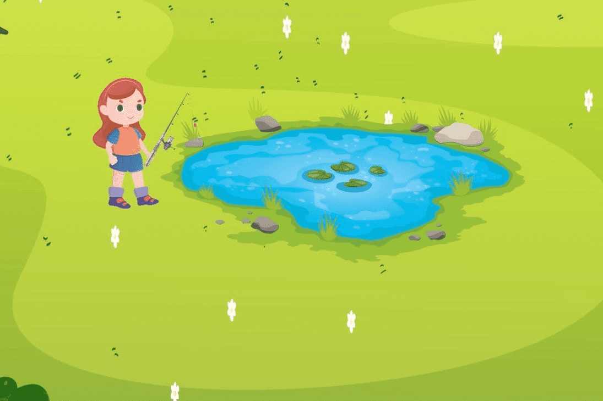

# METAFISH

MetaFish 是 BSC 上第一个推荐游戏赚取 Metaverse NFT 游戏，其灵感来自名为 Play Together 的流行游戏，在该游戏中，用户扮演渔民的角色，他们的钓竿作为有价值和可销售的 NFT 资产.

MetaFish是一个巨大的数字世界，用户在其中扮演渔民的角色，他们的竹竿作为有价值和可销售的nft资产

渔民可以在商店购买鱼竿或到鱼市场兑换，在钓竿破损前修复，参加钓鱼比赛

渔民可以使用META创建自己的团队FISH推荐系统，他们招募对的渔民越多，他们获得的钓鱼奖励就越多。

