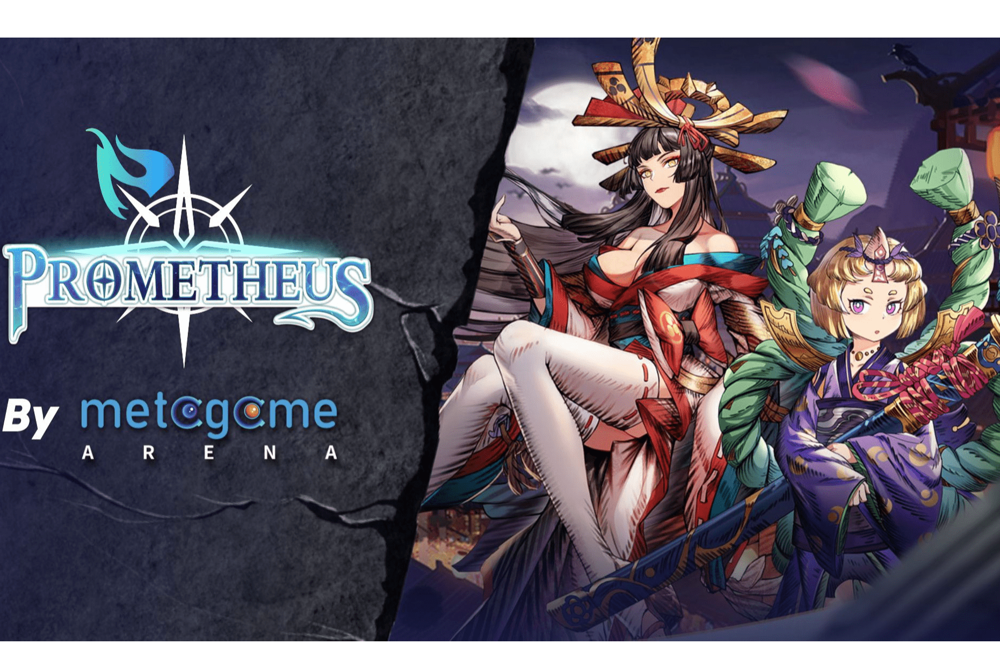

# Metagame Arena

Prometheus 的 NFT 分为三个主要系列：日本、希腊和北欧。我们将发布的第一个 NFT 系列是日本派系的 NFT 合集。
未来我们将基于我们的神卡和战斗卡制作一个全面的 NFT 战利品版本。特定的 NFT 战利品设置将由社区玩家修改；我们将考虑来自社区的想法，并提供 MGA 空投奖品。 NFT的抵押借贷功能在不久的将来，我们将进行NFT质押接待。玩家将质押 NFT 以换取 MGA 和 WP，这将有助于游戏的冷启动并减少组建稳固收益公会的初始障碍。它还建立了一个用于交易游戏代币的去中心化交易所（DEX）。

