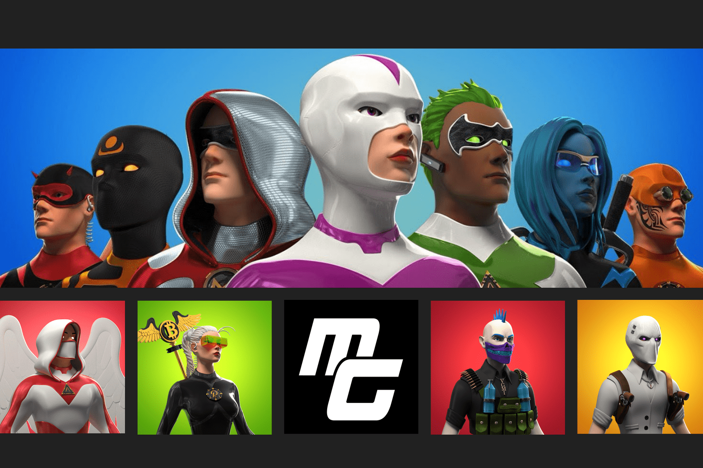

# Metaguardians

成为守护者来保护虚拟世界！还是你会成为恶棍？ Metaguardians 是一个不断扩展的超级英雄世界，包含视频游戏和虚拟宇宙收藏品（以太坊上的 ERC-721 NFT）。新系列每 7 周发布一次，代表不同级别的 Metaguardians 会员。 （白金会员免费 - 守护者和恶棍。）会员资格是可堆叠的，并解锁访问 Metaguardians.com web3 应用程序和即将推出的游戏赚取视频游戏中的独家奖励和活动。

免费 NFT 收藏
随着 Metaguardians 世界的扩展，每个季节都铸造一个免费的收藏 NFT。每个系列都有独特的薄荷和奖励通行证、元界和游戏福利。

奖励通行证
将您的 Metaguardians NFT 存入 web3 应用程序以激活 Mint & Rewards Pass。赢取能量石、独家赠品、ERC-20 代币等等！

即玩即赚
每个 NFT 在我们即将推出的游戏中都具有独特的优势和独特的角色，包括访问独家功能、奖金奖励、折扣等。

元界物业
为 Decentraland、Somnium Space 等开放虚拟世界索取免费内容，包括头像、可穿戴设备等！在开放的元节中获得对 Metaguardians VIP 区域的独家访问权。

商业权利
在 Metaguardians 中，我们提供了一个“工具”包，包括 3D 高分辨率图像、3D 装配体等等，供所有者下载和使用，拥有在“Metaguardians”品牌之外将自己的 NFT 商业化的权利。

