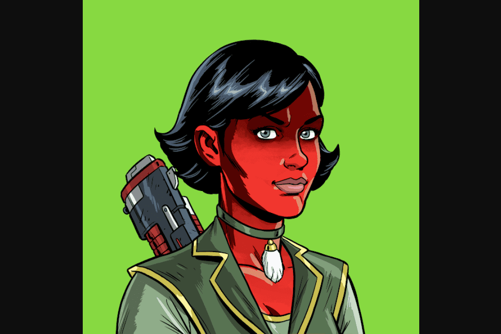

# MetaHero Universe: Generative Identities

MetaHero Identities 是 MetaHero 宇宙中的英雄、恶棍和变种人的集合。核心合集包含 146 个完全匹配的 MetaHero 概念角色，包括两个特殊薄荷糖，由项目创意人员 Chris Wahl 和 Odious 共同设计。可通过兑换 MintPass #1（由 Pixel Vault 开发的签名 NFT 预订系统）随时铸造生成的 MetaHero 身份（最大供应量 9,678）。MetaHero Identities 是 MetaHero 宇宙中的英雄、恶棍和变种人的集合。核心合集包含 146 个完全匹配的 MetaHero 概念角色，包括两个特殊薄荷糖，由项目创意人员 Chris Wahl 和 Odious 共同设计。

